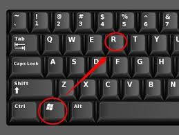
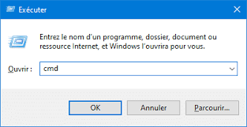
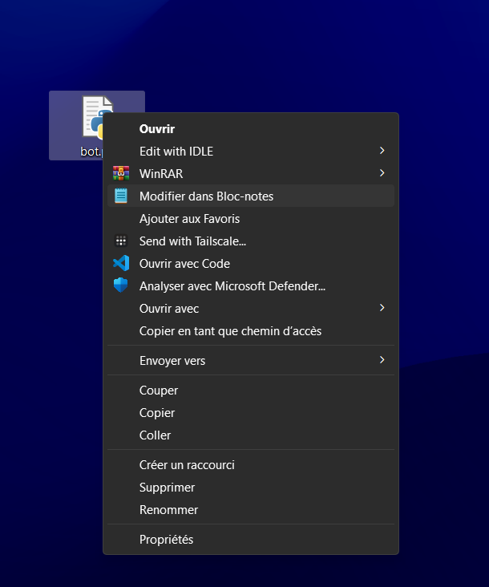

# Discord Bot Bump Reminder

Un bot Discord simple pour automatiser les rappels de "bump" et fournir des informations utiles. Le bot envoie des rappels dans un canal Discord pour que les utilisateurs n'oublient pas de "bump" le serveur.

## Fonctionnalités

- **+ping** : Vérifie que le bot est en ligne.
- **+info** : Affiche des informations sur le bot.
- **+help** : Affiche le guide d'aide avec la liste des commandes disponibles.

## Installation du Bot sur Windows
Pour les autres systèmes, contactez-moi sur Discord : deleted_user_562 ou sur [mon serveur](https://discord.gg/kkuU6CbQBG).

### Étape 1 : Télécharger le projet

1. Pour télécharger le projet, cliquez sur le lien suivant :  
   [Télécharger le projet](https://github.com/delete-user-56/Discord-Bot-Bump-Reminder/archive/refs/heads/main.zip)
   
2. Une fois téléchargé, extrayez le fichier ZIP dans un dossier sur votre ordinateur.

### Étape 2 : Ouvrir un terminal

1. Appuyez sur **Windows + R** pour ouvrir la fenêtre "Exécuter".



2. Tapez `cmd` puis appuyez sur **Entrée**. Cela ouvrira l'invite de commande.



### Étape 3 : Installer Python et les dépendances

1. Si vous n'avez pas encore installé **Python**, vous pouvez le télécharger depuis [le site officiel de Python](https://www.python.org/downloads/).

2. Ensuite, une fois Python installé, vous devez installer les dépendances du projet.

Tapez la commande suivante pour installer les dépendances nécessaires :

   ```bash
   pip install discord.py
````

## Étape 4 : Configuration du bot

1. Ouvrez le fichier `bot.py` dans un éditeur de texte comme **Bloc note**.



3. Modifiez les lignes suivantes dans le fichier avec vos propres informations :

   ```python
   TOKEN = "BOT_TOKEN"  # Remplacez par le token de votre bot
   CHANNEL_ID = 1234567890123456789 # Remplacez par l'ID du salon pour bumpe
   ROLE_ID = 1234567890123456789 # Remplacez par l'ID du rôle qui vas etre ping toutes les 5 heurs
   ````
   Si vous n'avez pas de bot Discord, vous pouvez en créer un gratuitement [ici](https://discord.com/developers/applications).
